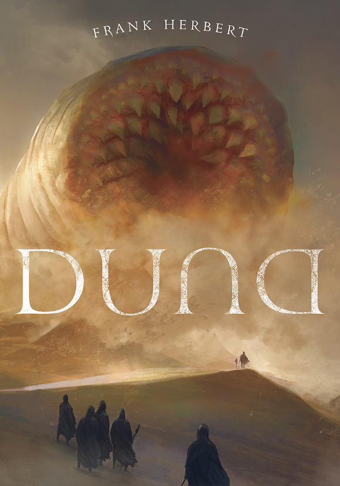
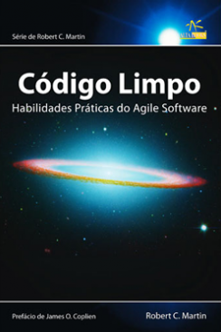
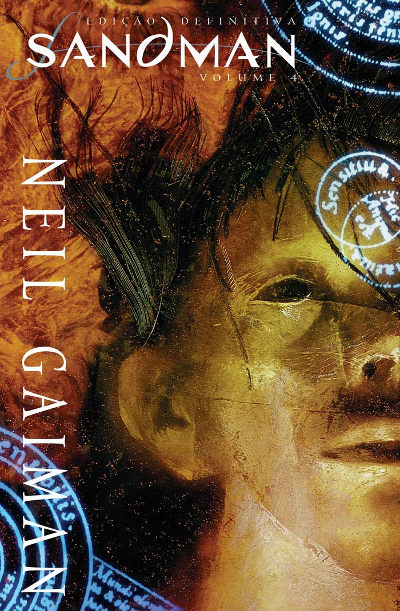

# seboleitordigital.com.br
É um site com  um acervo ainda pequeno de livros e quadrinhos.
Façam um bom proveito dos livros disponivel no site!
Mas para além disso, esse projeto foi é onde estudo e coloco o que estou aprendendo em pratica HTML, CSS etc...
 
projeto/
├── server.js           # servidor Node
├── package.json
├── livros/             # pasta com os PDFs (fora do público)
│   ├── duna.pdf
│   ├── steve-jobs.pdf
│   └── ...
├── public/             # seu site estático (HTML, CSS, JS)
│   ├── index.html
│   ├── style.css
│   └── script.js
└── .env                # variáveis (se usar)

<table>
        <tr>
            <td>
            
Duna
</td>
            <td>
            
Código Limpo
</td>
            <td>
            
Steve Jobs
</td>
            <td>
            
7 Hábitos das Pessoas Altamente Eficientes
</td>
            <td>
            
São Cipriano
</td>
        <tr>
          <td></td>
          <td></td>
          <td></td>
          <td></td>
          <td></td>
          <td></td>
      </table>